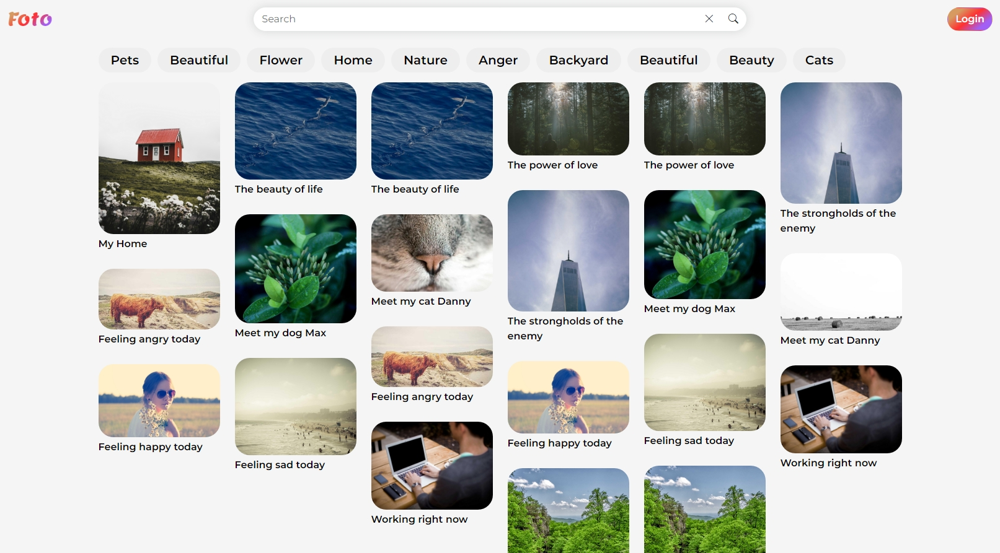
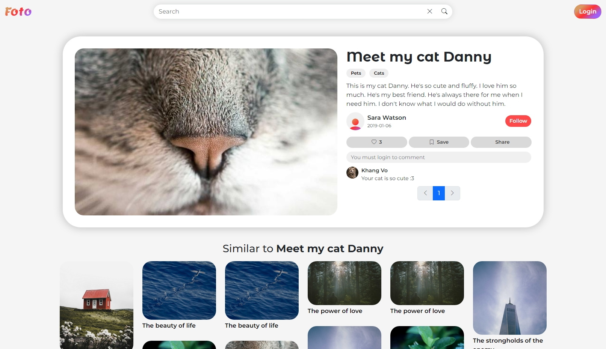
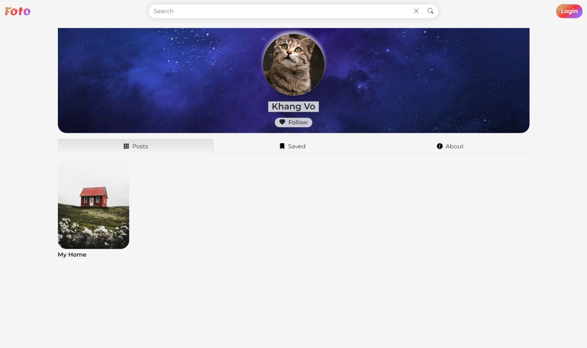
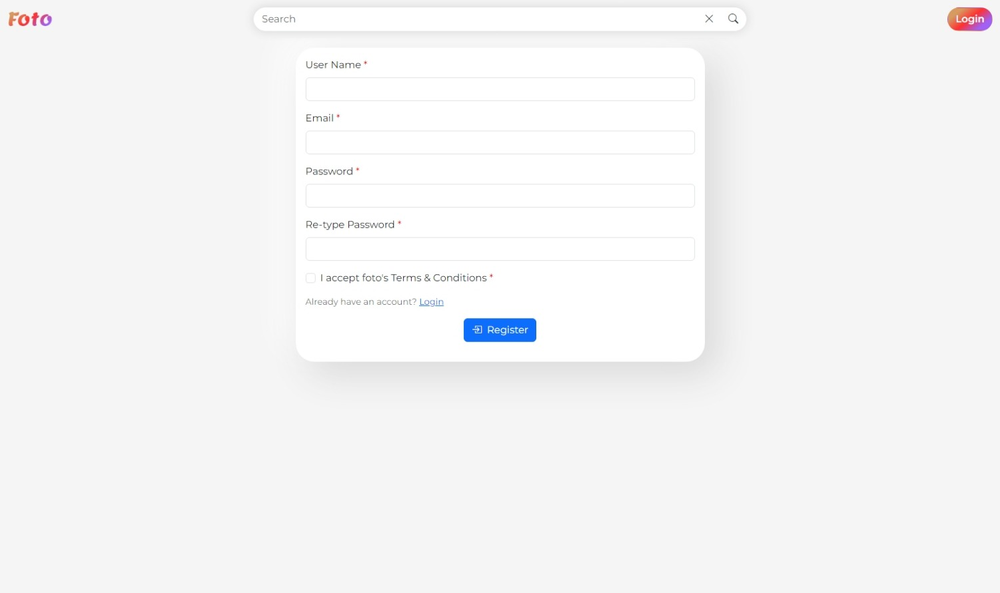

_Khang Vo_  
_COS30043 - Interface Design and Development_  
_Swinburne University of Technology_

# Vue Photo-Sharing Website Project
Website URL: [https://266jaspurr.ddns.net/khangvo/foto/](https://266jaspurr.ddns.net/khangvo/foto/)

**Project Description:**
* This project is a photo-sharing website, developed using Vue.js 3, Vuex, Vue-router, Vuejs-paginate-next, and Bootstrap 5.
* The backend is developed using Python, FastAPI, and SQLite.
* The website allows users to register, post photos, and interact with other users' posts by reacting, saving and commenting.
* For more details, please refer to the Report.pdf

**Project setup:**
* Dependencies installation
```
npm install
```

* Compiles and hot-reloads for development
```
npm run serve
```

* Compiles and minifies for production
```
npm run build
```

* Lints and fixes files
```
npm run lint
```

**Website Screenshots:**



